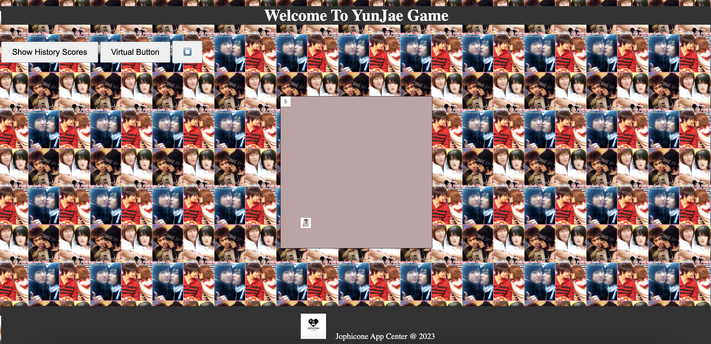

# YunJae-GAME

This web-based game is a tribute to my love for YunJae. It's an original snake game with a special theme.

## Description

YunJae-GAME is a classic snake game where players control a snake to collect items and grow longer. The game incorporates elements inspired by YunJae to make it a unique and enjoyable experience.

## Features

- Classic snake gameplay
- YunJae-inspired theme
- [Add any additional features]

## Getting Started

To play the game, simply [provide instructions on how to access or run the game].

## Screenshots

## Technologies Used

- HTML
- CSS
- JavaScript

## How to Contribute

If you'd like to contribute to the project, please follow these steps:

1. Fork the repository
2. Create a new branch (`git checkout -b feature/new-feature`)
3. Make your changes
4. Commit your changes (`git commit -m 'Add new feature'`)
5. Push to the branch (`git push origin feature/new-feature`)
6. Create a pull request

## License

This project is licensed under the MIT License - see the [LICENSE](LICENSE) file for details.

**Note: Please do not reupload without permission. Thank you!**

